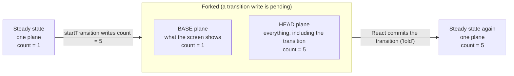
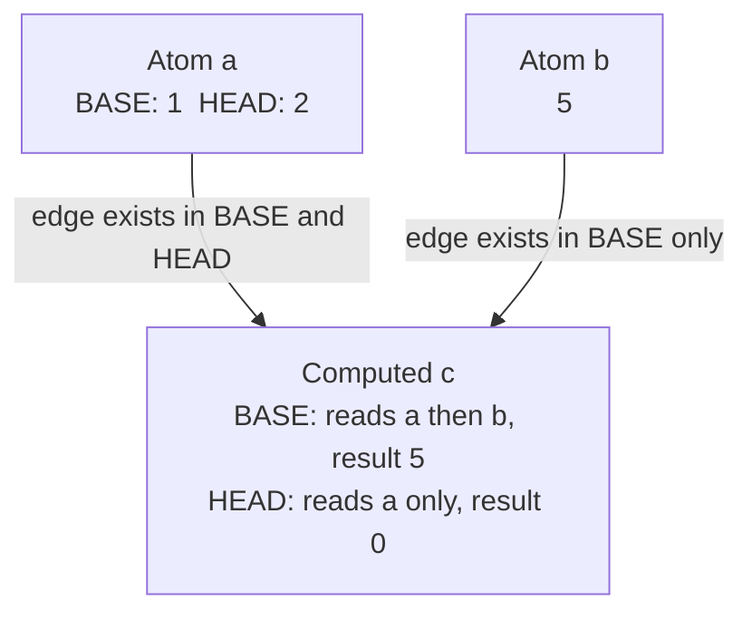
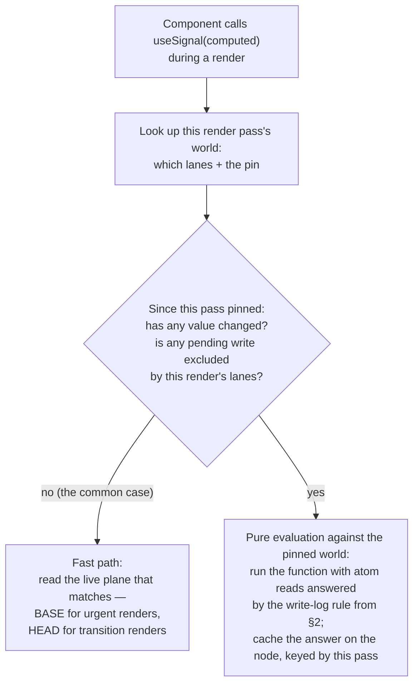
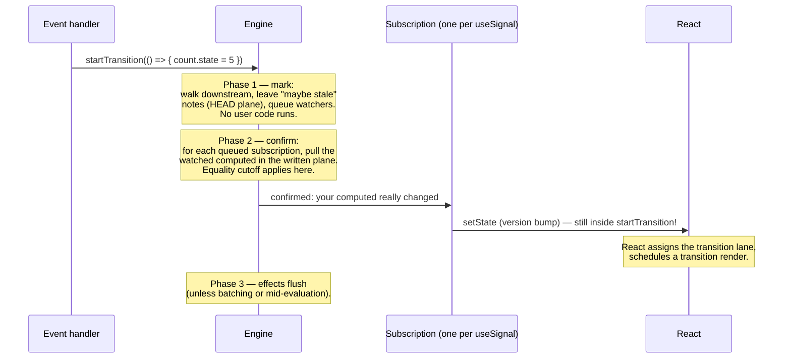

# react-signals — Design

A signals library for React with first-class concurrent rendering support:
no `useSyncExternalStore`, full `startTransition` integration, Suspense parity,
and a small React patch that exposes the render/commit lifecycle to userspace.

Research backing every claim here lives in `notes/research/` (exact file:line
references into the submodules). Read `notes/design/00-candidates.md` for the
alternatives we rejected and why.

---

## 1. The problem with external stores in concurrent React

`useSyncExternalStore` keeps a single mutable snapshot outside React, so it
must force synchronization: every store change notification schedules
**SyncLane** work regardless of context, and any store write that lands during
a concurrent render causes React to discard the finished render and re-render
the whole root **synchronously** (`isRenderConsistentWithExternalStores`,
see notes/research/react-uses-use-suspense.md §1.4). Store state can never ride
in a transition. That is the de-opt we are eliminating.

The insight (validated by the React team's `react-concurrent-store`
experiment, notes/research/react-concurrent-store.md): **React's hook update
queue is already a multi-version store.** Every queued update carries a lane;
a render at lanes `R` applies exactly the updates whose lane is in `R` and
rebases the rest. If a signal write notifies subscribed components by calling
their `setState` synchronously *in the writer's execution context*, React
assigns every one of those updates the writer's lane (transition, sync, default
— whatever `requestUpdateLane` decides), and lane bookkeeping, rebasing,
entanglement, batching, and infinite-update-loop protection all apply to signal
state exactly as they do to `useState`.

What userspace alone cannot do (all hit by react-concurrent-store, §5/§8 of its
report):

1. **Know which world a render wants.** A component mounting during a
   transition render has no queued update to tell it whether to read pending or
   committed values. Userland must guess, double-render, and has a genuine
   suspense bug. Needs: current render lanes.
2. **Know when a write's world commits.** Folding pending values into
   committed state requires a commit signal (their `CommitTracker` is an
   admitted kludge). Needs: per-root commit lifecycle.
3. **Keep a yielded render consistent.** A time-sliced render can resume after
   an unrelated write; reads must not tear. Needs: render-pass lifecycle.

These three, plus the (unrelated) DOM-mutation window, define the React patch
(§6). Everything else is userspace.

## 2. State model: committed base + write log

Signal state lives in the graph nodes (single storage, not copied per
subscriber). Each atom holds:

- a committed value — the value every React tree that has finished committing
  agrees on;
- a small **write log**: a list of recent writes, created only while React
  bindings are active. Think of it as a receipt tape. Each entry records:
  - the written `value`;
  - the `lane` React assigned to the write (which "priority channel" the
    write's re-renders ride on — a transition lane, the urgent/sync lane,
    and so on);
  - `seq` — a ticket number from a global take-a-number counter, so every
    write in the whole program has a position in one shared timeline;
  - `foldedAtSeq` — zero while the write is still pending, and stamped with a
    fresh ticket number at the moment the write becomes part of committed
    state (when React commits it, see "Folding" below).

Fast path: when no transition or concurrent work is pending, the log is empty
and an atom is just its value — pure-core users (and the benchmark) never pay
for any of this.

### The read rule

Every read resolves against a **read context**:

- **Outside render** (event handlers, core effects, benchmarks): newest write
  wins, always. This matches the benchmark contract "reads mid-batch see
  fresh values".
- **During a render pass**: at the moment the pass starts, the bindings note
  the current ticket number — the pass's **pin**. For the rest of that pass
  (even if React pauses it and resumes later), an atom read returns the value
  of the newest log entry that passes either test:
  1. **It already committed, before this pass started.** (Its `foldedAtSeq`
     stamp is at or below the pin.)
  2. **This render is rendering its lane, and the write existed when the pass
     started.** (Its lane is one of the render's lanes, and its `seq` ticket
     is at or below the pin.)

  If no entry qualifies, the read falls back to the value from before the
  oldest retained entry.

Each clause mirrors something React itself does with its hook update queues:

- Clause 2's lane test is exactly React's rule for which queued `setState`
  updates apply in a given render: a render at transition priority applies
  transition updates and skips urgent ones, and vice versa.
- Both clauses' "before the pass started" tests mirror
  `finishQueueingConcurrentUpdates`: updates that arrive while a render is in
  progress are hidden from that render and picked up by the next one.
- Clause 1 using the *fold time* rather than the *write time* is what keeps a
  paused-and-resumed render consistent: if some other root commits (and folds
  a write) while this render is paused, the fold's stamp is above this pass's
  pin, so this pass keeps reading the value it started with. Old values are
  retained only while some active pass could still need them — races are rare
  and renders are short, so the retained history is transient.

### Folding

"Folding" is how a pending write becomes committed state. On each root commit
(the patch tells us which lanes committed and which are still pending):

- log entries whose lane just committed get their `foldedAtSeq` stamp, and the
  newest of them becomes the atom's committed value — unless a newer write is
  already part of committed state. Committed state is strictly
  last-write-wins in write order: each atom remembers the ticket number of the
  write it currently reflects (`baseSeq`), and a fold never rolls it back to
  an older write. (Without this guard, committing an old transition after a
  newer urgent write would resurrect the stale value — a confirmed bug during
  review, now a regression test.)
- entries whose lane is no longer pending in any root we know about fold too:
  the work was discarded (say, the only subscriber unmounted), but the write
  still happened, so committed state must still converge to it;
- writes made while nothing at all is subscribed fold immediately — no render
  will ever commit them, and pure-core semantics must not change.

Multi-root note: lanes are per-root but transition lanes are claimed from a
module-global cursor and all pending transition lanes render as **one batch**
in today's React (`getHighestPriorityLanes`; `enableParallelTransitions` off —
notes/research/react-lanes-transitions.md §10). v1 folds a write when the first
root commits its lane; other roots' urgent renders may briefly observe the new
committed value before their own transition commit lands. Their in-progress
passes are protected by their pins (the fold-time stamp is above the pin); the
relaxation is documented and a refcounted fold (wait for all broadcast-target
roots) is a contained upgrade.

### Rebasing

Because atoms are last-write-wins, the interleaving that forces
react-concurrent-store to re-run reducers ("sync write while a transition is
pending") needs no special machinery. Walk it through with `a` written by a
transition and `b` written urgently while that transition is still pending:

| log entry | lane | pending or committed? |
|---|---|---|
| `a = 1` | transition | pending |
| `b = 1` | sync (urgent) | pending, commits first |

- The **urgent render** renders sync lanes: it sees `b = 1` (clause 2) but not
  `a = 1` (transition lane not included) — the screen updates with the urgent
  change only, transition still invisible. React commits it; `b`'s entry
  folds.
- The **transition render** afterwards sees `a = 1` (its own lane, clause 2)
  *and* `b = 1` (already folded, clause 1) — the transition lands on top of
  the urgent change, never wiping it out.

Each render's lane filter produces exactly the result React's own update-queue
rebasing would produce for `useState`.

## 3. Core graph (`src/core`, zero React imports)

A port of alien-signals' push-pull algorithm (data structures and invariants
documented in notes/research/alien-signals.md), adapted:

- **Nodes**: intrusive doubly-linked dependency/subscriber lists (`Link` shared
  between both lists), flags bitmask, cursor-based link reuse across re-runs,
  `purgeDeps` pruning. Plain `const` objects instead of `const enum`
  (stripping-only TS).
- **Push**: writes mark subscribers `Pending` (cheap); **pull**: reads resolve
  `Pending → Dirty/clean` via `checkDirty` with equality cutoff. Exact lazy
  pull counts (the `testPullCounts: true` club in the benchmark).
- **Equality**: `isEqual` option threaded through the three compare sites
  (write short-circuit, signal commit, computed update); defaults `Object.is`.
- **Worlds**: dirty/pending flags and propagation run on the **head** plane
  (head is what notification cares about). Committed-plane values for render
  reads are resolved by the read rule (§2) — committed reads of computeds
  validate with per-dependency epoch/seq stamps (pull-only, no second flag
  plane), caching one committed result per node keyed by global epoch.
- **Computed value states**: `{status: 'value' | 'error' | 'suspended', …}`.
  Evaluation never throws through the graph (a throwing getter or pending
  `ctx.use` thenable becomes a cached error/suspended state); read sites
  rethrow or suspend. Fixes alien-signals' throw-corrupts-flags hazard.
- **Suspense**: `ctx.use(thenable)` stamps `status/value/reason` on the
  thenable (same protocol React uses), caches it positionally per node so
  identity is stable across re-evaluations, and marks the computed
  `suspended`. Suspended computeds re-check thenable status on read; non-render
  watchers attach a settle listener that invalidates + notifies.
- **Writes inside computeds**: allowed by default. `runDepth`-style tracking
  is extended to computed evaluation (alien-signals only tracks effects);
  effect flush is deferred during evaluation; a write whose propagation reaches
  the currently-evaluating node (via the `isValidLink` machinery) or a read of
  a node currently evaluating (`RecursedCheck`) throws a cycle error.
  `configure({ forbidWritesInComputeds: true })` makes any in-computed write
  throw at write time.
- **Atom observed-lifecycle**: watcher refcount (hooks, signal-effects, and
  transitively-watched computeds count). 0→1 runs the atom's `effect(ctx)`;
  1→0 runs its cleanup, deferred to a post-commit sweep so remount-within-a-
  commit doesn't thrash remote subscriptions (react-concurrent-store's sweep
  pattern).
- **Effects & scheduling**: core effects are synchronous with an explicit
  queue + `flush()` (ancestors-first, alien-signals ordering). React bindings
  never use core effects' scheduler; the benchmark adapter drains the queue in
  `withBatch`.
- **Tracing slots**: a module-level `tracer` that is `null` unless the tracing
  module is loaded; every interesting transition does `tracer !== null &&
  tracer.emit(...)` with a cause id, so the untraced cost is one null check.

## 4. React bindings (`src/react`)

### `useSignal(signal)`

- One `useState(0)` version counter per hook — the re-render trigger. The
  value rendered is always read from the graph with the current render's read
  context (render lanes + pin via the patch API), so mounts inside a transition
  render read the pending world directly: no double render, no
  mount-mid-transition suspense bug (react-concurrent-store's known-bug test
  becomes a passing test for us).
- Subscribes in a layout effect. The subscriber is a graph watcher node whose
  notify = `setVersion(v => v + 1)` called synchronously in the writer's
  context — lane assignment, batching, async-action entanglement all inherited
  from React. Graph-level equality cutoff means no broadcast (no render) when
  a write doesn't change this node's output in the writer's world.
- Post-subscribe fixup in the same layout effect (covers writes racing between
  render and subscription): compare rendered value to current committed value
  (sync `setVersion` → pre-paint correction) and to head (fixup inside
  `startTransition` to join the pending batch) — Eldredge's protocol, needed
  only in race windows rather than on every mount.
- If the value is a suspended computed, rethrow via React's `use(thenable)`
  (conditional `use` is legal): React's replay machinery handles resolution;
  our positional thenable cache keeps promise identity stable across replays.
- Unmount: unsubscribe; watcher refcounts sweep post-commit.

### `useComputed(fn, deps)`

A component-local `Computed` held in a ref, recreated when `deps` change
(deps compared like `useMemo`). `fn` closes over props/state freely — that's
what `deps` is for; signal reads inside `fn` are auto-tracked by the graph.
Subscription and reads work exactly like `useSignal` on the local node.

### `useSignalEffect(fn, deps)`

Runs `fn` tracked after commit (passive effect). Re-runs when `deps` change
(React pathway) or when a tracked signal's committed value changes — the graph
queues the effect during fold (§2) and flushes in a microtask, i.e. effects
observe committed worlds only, matching useEffect's "after commit" semantics.
Cleanup supported like `useEffect`.

### `<SignalsProvider>` — not required

The patch's global registry callbacks make a library-owned root component
unnecessary (PROMPT allows one "if strictly necessary" — it is not). Multiple
roots work because callbacks carry the root.

### Infinite-loop integration

All re-renders flow through `setState`, so every broadcast passes
`throwIfInfiniteUpdateLoopDetected` and commit-time nested-update counting
(NESTED_UPDATE_LIMIT = 50), and render-phase loops hit RE_RENDER_LIMIT = 25.
Pure signal→signal effect cycles (never touching React) are bounded by the
core's own re-entrancy guard.

### SSR / hydration

Server rendering reads committed values with no subscriptions and no atom
`effect` mounting. Hydration renders from the same committed values; apps
serialize atom state and initialize atoms before `hydrateRoot` (documented
recipe + helper). No `getServerSnapshot` analogue needed — reads are plain.

## 5. Tracing (`react-signals/tracing`, lazy)

Event schema with causality: every event has `id`, `ts`, `cause` (id of the
triggering event) and a type-specific payload — `atom-write`, `invalidate`,
`computed-eval` (+ reason: pull|validate), `broadcast` (lane, subscriber
count), `render-read` (world decision), `fold`, `effect-run`, `atom-observed`
/ `atom-unobserved`, `suspend`/`resolve`. Loading the module installs the
tracer into the core slot; a ring buffer plus subscription API feed the future
devtools timeline; helpers answer "why did X re-run" by walking cause chains.
Zero overhead unless loaded (single null check per site).

Two visualizer helpers live in a further-separate module,
`react-signals/graphviz`, which emits Graphviz DOT source (render it with
`dot -Tsvg` or any Graphviz viewer — DOT handles graph sizes that crash
Mermaid renderers):

- `dependencyGraphToDot(signals)` — a snapshot of the live dependency graph
  reachable from the given signals: atoms, computeds, watchers, per-plane
  values while forked, stale flags, and which plane each edge belongs to.
- `traceToDot(events)` — a causal graph of tracing events (write → eval →
  notify → effect chains), filterable by event type.

The module layering is strict: `tracing` installs and records events without
loading any visualizer code, and `graphviz` imports only *types* from tracing,
so either can load without the other.

## 6. React patch (vendor/react, minimal)

Two independent features, both following the established
`ReactSharedInternals` renderer-registration pattern (the `S`/
`onStartTransitionFinish` precedent — the reconciler fills slots on the shared
object at module init; isomorphic code calls them; multiple renderers chain).
No Fiber shapes cross the boundary; lanes pass as documented-opaque numbers;
roots pass as opaque tokens (identity only).

### 6.1 Concurrent lifecycle for external state (`unstable_externalRuntime`)

Registry callbacks (library subscribes once):

- `onRenderPassStart(root, lanes)` / `onRenderPassEnd(root)` — brackets a
  render *pass* (fresh stack → completion/discard), spanning yields. Drives
  epoch pins.
- `onCommit(root, committedLanes, remainingLanes)` — drives folding, effect
  scheduling, watcher sweeps.

Queries:

- `getCurrentUpdateLane()` — the lane `requestUpdateLane` would assign right
  now (transition scope / async-action entangled lane / event priority).
  Stamped on write-log entries at broadcast time.
- `getRenderContext()` — `null` outside render; `{root, lanes}` during render.
  Drives the read rule and "inside render" detection.
- `laneIntersects(lanes, lane)` — subset test without exposing bit layout.

### 6.2 DOM mutation window

`onBeforeMutation(root)` / `onAfterMutation(root)` bracketing exactly React's
commit mutation phase, so a `MutationObserver` can disconnect/reconnect around
React's own DOM writes while observing everything else. (Unrelated to signals;
same registry, delivered per root.)

Placement facts (notes/research/react-commit-and-build.md §1): the hooks must
live inside `flushMutationEffects` — not `commitRoot` — because with View
Transitions the mutation phase runs later, inside the browser's
`startViewTransition` update callback. Bracketing `commitMutationEffects` +
`resetAfterCommit` there covers every commit path (including `flushSync` via
`flushPendingEffects`) and fires only when mutations will actually occur.
Scope is React's *reconciliation* mutations: documented exceptions are the
layout-phase `` re-assignment, suspensey-CSS `<link>` insertion,
imperative Float APIs (`preload`/`preinit`), View Transition name attributes,
and user effect code — callers who need those too should filter, not expect
the bracket to cover them.

### Patch principles

- Additions are unconditional (no feature flag) but inert until a listener
  registers: near-zero cost on the hot path (one null check per site).
- Each hook site documents its invariant ("fires after X, before Y").
- Built and consumed via `scripts/build-react.sh` →
  `build/oss-experimental/*`, linked into the workspace through pnpm
  overrides; rebuilds require no reinstall.

## 7. Testing

- **Core**: graph semantics (laziness, cutoff, dynamic deps, repeated reads,
  cycles, write-in-computed policies, observed lifecycle), the shared
  reactive-framework conformance expectations, benchmark contract tests
  (sync effect flush, fresh mid-batch reads, exact pull counts).
- **React**: adopt react-concurrent-store's harness wholesale
  (vitest + jsdom + RTL; transitions held open by controlled promises;
  TestLogger render-order asserts with afterEach-empty; inline DOM snapshots
  for tear checks; listener-leak asserts; controlled thenables for suspense)
  and its 14-scenario suite as our conformance bar — including making their
  known-bug case (sync mount mid-transition with suspending head state) pass.
  Plus: signal+React-state lockstep in one transition, interruption/rebase,
  multiple roots, useComputed over props+state+signals, useSignalEffect
  re-runs, infinite-loop rejection, MutationObserver window, hydration.
- **Benchmark**: adapter over the core (§3) registered in
  js-reactivity-benchmark; conformance tests must pass with
  `testPullCounts: true`.

## 8. Performance stance

- Reads: bare bound-function call + null-ish checks on the world log (empty in
  steady state). Writes: alien-signals propagation; broadcasts only on real
  (per-world) value changes.
- No per-subscriber value copies, no consistency-check tree walks, no forced
  sync re-renders, no per-render allocations in uSES's style.
- Target: within noise of `useState` for re-render-on-change; alien-signals
  -class results on the core benchmark.

## 9. Walkthrough: how a computed works under concurrent rendering

This section re-explains the machinery above in plain language, following one
computed through its life. It adds no new rules — everything here is §2 and §3
again, slower and with pictures. Code references are into
`packages/react-signals/src/core/engine.ts`.

### 9.1 A computed is a cache with sticky notes

A `Computed` stores the answer from the last time its function ran, plus two
"sticky note" flags:

- **definitely stale** (`Dirty`): a value it directly reads has changed; the
  next read must re-run the function.
- **maybe stale** (`Pending`): something *somewhere upstream* changed; the
  next read must first check whether the change actually reached us.

Writing an atom doesn't compute anything. It just walks downstream through the
dependency edges putting "maybe stale" notes on everything it can reach
(`propagate`). The work happens on *read*: a read that finds a "maybe stale"
note walks *upstream* (`checkDirty`), re-running only the upstream computeds
that truly changed. If some upstream computed re-runs and produces the same
answer as before (checked with `isEqual`), the staleness stops there — nothing
below it re-runs. That's the "equality cutoff", and it's why
`parity = count % 2` doesn't re-render anything when `count` goes from 1 to 3.

So far this is a completely ordinary signals library. Concurrency is where it
stops being ordinary.

### 9.2 The problem: React needs several "presents" at once

Say `count` is 1 and a transition writes `count = 5`. Until that transition
commits, React is living in two moments at once:

- The screen (and any urgent render that happens meanwhile) must keep acting
  like `count` is 1.
- The transition render must act like `count` is 5.

A computed with **one** cached value cannot serve both. So while any
transition write is pending, the engine splits — "forks" — into two **planes**
(two parallel sets of values and sticky notes over the same graph):

- **BASE**: committed state plus pending *urgent* writes. Urgent renders and
  effects read this.
- **HEAD**: every write including pending transitions. Transition renders and
  non-render reads (event handlers) read this.



The fork is temporary. When React commits the transition, the pending writes
"fold" into committed state, the two planes agree again, and the engine goes
back to being a plain single-plane signals library. Code that never uses
transitions (or never uses React at all) never forks — that's why the
benchmark numbers stay close to alien-signals.

A forked computed carries one result per plane (`value` / `headValue`, plus a
status and error/promise slot for each) and one set of sticky notes per plane
(`Pending`/`Dirty` for BASE, `HeadPending`/`HeadDirty` for HEAD). A transition
write puts notes only in the HEAD set; an urgent write puts notes in both,
because an urgent write is part of both worlds' futures.

### 9.3 Even the dependency edges are per-plane

Here's the trap that makes this harder than "keep two values". A computed's
dependencies come from whatever its function *actually reads*, and the two
planes can make it read different things:

```ts
const c = new Computed({
  fn: () => (a.state <= 1 ? b.state : 0),
});
```

With committed `a = 1` and a pending transition `a = 2`:



In the HEAD world, `a` is 2, the condition is false, and `c` never touches
`b` — so in that world there is no `b → c` edge at all. But in the BASE world
`c` very much depends on `b`: if an urgent write changes `b`, the *screen's*
version of `c` must update, even though the transition's version doesn't care.

If edges were shared between planes, whichever plane evaluated last would
erase the other plane's edges, and one of those updates would be silently
lost. So every edge (`Link`) carries two membership bits — "this edge exists
in BASE" / "this edge exists in HEAD" — and an evaluation only rewrites its
own plane's bits. A write follows only the edges that exist in the plane(s)
it is writing to. (This exact scenario is a regression test:
`test/core.test.ts`, "dependency sets can differ between planes without
missing updates".)

### 9.4 The head result is created lazily — and suspiciously

Forking doesn't eagerly copy anything. The first time someone reads a
computed's HEAD result during a fork, the engine "seeds" it from the BASE
result (`seedHead`), on the theory that before the fork both worlds were the
same — and then lets the normal sticky notes decide whether that seed is
already stale (the transition's write marked everything downstream of it).

The one thing the seed must never trust: a BASE result that was computed
*during* the current fork. That result deliberately excluded the transition's
writes, so it is not "the shared state from before the fork" — seeding HEAD
from it would hand the transition render pre-transition values. Each computed
remembers which fork generation last recomputed its BASE result (`baseGen`);
if that matches the current fork, the seed is skipped and the HEAD result is
computed from scratch. (Found by the adversarial review; also a regression
test now.)

### 9.5 What actually happens when a component reads a computed

`useSignal` never asks for "the current value". At the start of every render
pass, a callback from the React patch creates a **render world** for the pass:
the pass's lanes plus a pin (the write-ticket number at that instant, §2). All
reads in that pass resolve against that world, and the world never changes for
the life of the pass — even if React pauses the render and resumes it later.



Two things about the slow ("pure") path are worth spelling out:

- **The per-pass cache never needs re-checking.** The pin makes the world
  immutable: writes that land mid-pass have ticket numbers above the pin, and
  folds that happen mid-pass have fold stamps above the pin, so neither can
  change what this pass is allowed to see. One evaluation per computed per
  pass is correct by construction. When the last active pass ends, these
  caches are dropped.
- **The pure path creates no graph edges.** React is allowed to throw a
  render away (that's the whole point of concurrent rendering). If a
  `useComputed` node from a discarded render had linked itself into the
  graph, it would sit in some atom's subscriber list forever — a leak. Pure
  evaluations leave no trace; a computed only gets wired into the graph when
  its component actually commits and subscribes.

A pleasant consequence of reading through the render world: a component that
*mounts inside a transition render* simply reads the transition's values,
because that's what its render's world contains. The same situation is the
one react-concurrent-store's authors document as impossible to fix from
userland (their readers must guess, render twice, and can still get stuck in
a suspense fallback). Here it needs no special case at all.

### 9.6 How a write turns into re-renders

When an atom is written, three strictly ordered phases run — all before the
write call returns, which is the entire trick for transition integration:



- Because phase 2 runs while the write call is still on the stack — inside
  the user's `startTransition` — React gives the resulting `setState` the
  same lane it would give any `setState` written next to the signal write.
  That's the whole integration: no lane plumbing, just careful timing.
- Confirmation is per-plane. A forked urgent write might change a computed's
  BASE answer while its HEAD answer stays the same (or the reverse); each
  marked plane is checked separately, so exactly the right renders get
  scheduled and no more.
- The phase order is load-bearing. An early version confirmed subscriptions
  *during* the marking walk, and the first subscriber's pull would clear the
  atom's "changed" flag before its sibling subscribers had even been marked —
  one component re-rendered, the other silently never did. All three
  adversarial reviewers found versions of this; the strict
  mark-everything-first protocol is now documented as an invariant at the top
  of `engine.ts` and covered by regression tests.

### 9.7 Commit: fold, effects, reconverge

When React commits a render, the patch reports which lanes committed. Log
entries on those lanes fold into committed state (§2), and if no pending
transition writes remain, the planes reconverge — the fork is over.

Folding re-runs **effect** watchers (`useSignalEffect`, core `effect`),
because their world — committed state — just changed. It deliberately does
*not* notify component subscriptions: the components that cared were already
notified back in phase 2 at write time, and have either rendered those values
or have the render queued. Notifying them again would schedule a wasted
re-render of things already on screen.

This is also why `useSignalEffect` never sees a transition's values early:
effects re-run when the transition *commits*, matching `useEffect`'s
after-commit timing.

### 9.8 Suspense: a promise is just a third kind of answer

Inside a computed, `ctx.use(promise)` doesn't throw an exception through the
graph. Evaluation always completes with one of three results, stored like any
cached value:

| status | stored payload | what a reader gets |
|---|---|---|
| value | the value | the value |
| error | the thrown error | the error is re-thrown |
| suspended | the pending promise | a `SuspendedRead` carrying that promise |

`useSignal` catches `SuspendedRead` and hands the promise to React's `use()`,
so React's own suspense machinery does the waiting and replaying. Because the
status is per-plane, a computed can be a plain value in BASE while suspended
in HEAD — which is exactly the "transition into a loading state" case: the
screen keeps the old content (BASE has a value; no fallback appears) while
the transition render waits on the pending world's promise.

### 9.9 The whole story in one interleaving

This is the scenario from `test/react-hooks.test.tsx` ("urgent update
interleaving a pending transition"), with `sum = a + b * 100`, both atoms
starting at 0:

| step | what happens | log (lane, state) | screen shows |
|---|---|---|---|
| 1 | transition writes `a = 1`, held open | `a=1` (transition, pending) | `0` |
| 2 | engine forks; sum: BASE 0, HEAD 1; subscription confirmed in HEAD → transition render scheduled | | `0` |
| 3 | urgent write `b = 1` | + `b=1` (sync, pending) | `0` |
| 4 | urgent render: its world includes sync, excludes transition → sees `b` only → sum 100; commits; `b` folds | `b=1` folded | `100` |
| 5 | transition resolves; transition render: its world includes its own lane (`a=1`) and everything folded (`b=1`) → sum 101; commits; `a` folds; planes reconverge | log empty | `101` |

At no point does any render see the torn combinations (`1` or a stale `0`
after step 4), and the urgent change is never wiped out by the older
transition — the same guarantees React gives two `useState` hooks, extended
to shared derived state.

### 9.10 Seeing it live

`react-signals/graphviz` renders both halves of this story from a running
app: `dependencyGraphToDot` snapshots the graph (per-plane values, stale
flags, per-plane edges), and `traceToDot` turns a tracing session's events
into the causal chain a write followed. See §5.
